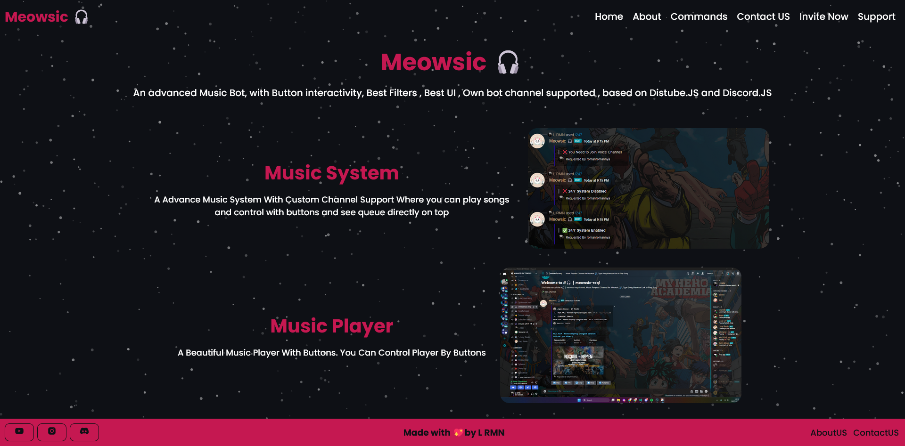

### Hello world 😳

_Mostly sleepless._

_i am not prepared for life, only the apocalypse_


[](https://www.twitter.com/romanromannya/)
[](https://instagram.com/romanroman.nya)
[](https://id.pinterest.com/romanroman.nya)
[](https://hi.lrmn.site)
[](https://open.spotify.com/user/31urnjrljaimmmf52sealktmdz3i/)
[](https://visitor-badge.laobi.icu/badge?page_id=lrmn7.lrmn7&)

## What i'am listening to
<a href="https://lrmn7.vercel.app/api/now-playing?open=yes">
  
</a>


<div align="center">
  
</div>

###

# Advance Discord Music Bot

a discord music bot with many commands , buttons , 24/7 , autoresume ,etc

## **Installation | How to use the Bot**

**1.** Install Latest LTS [NodeJS](https://nodejs.org/en/)

**2.** Download this repo and unzip it | or git clone it

**3.** Fill in everything in **`settings/config.js`**

### _Modify - config.js_

```javascript
{
  TOKEN: "BOT_TOKEN",
  PREFIX: "BOT_PREFIX",
  mongodb : "MONGO_URL"
}
```

### _Modify - .env_

_*Rename `.env.example` to `.env.` and configure it*_

```env
TOKEN=
MONGO_URL=
PREFIX=
GUILD_ID=
```

**4.** Now Let's Update Node Version. copy and paste in shell **`npm i --save-dev node@latest && npm config set prefix=$(pwd)/node_modules/node && export PATH=$(pwd)/node_modules/node/bin:$PATH`**

**5.** after Fill everything in config Type in shall **`npm install`**

**6.** now we need to install to additional packages **.** <br/>

1.  `npm install @discordjs/opus` - for better audio quality **.** <br/>
2.  `npm install zlib-sync@latest` - for WebSocket data compression and inflation **.** <br/>
3.  `npm install erlpack@latest` - for significantly faster WebSocket **.** <br/>

**7.** start the bot with **`node index.js`**

## Music Bot Features

- Easy to use Music Bot
- Support Youtube , Spotify , Soundcloud , etc 700+ websites
- Slash commands support
- Dashboard support
- Message commands support
- Stable & up to date with discord.js v14
- Support 24/7 in voice channel
- Support autoresume system
- Support music request channel system
- Support more filters
- Support dj system
- Work on replit and others vps

## Feedback

If you have any feedback, please reach out to us at [Discord Server](https://discord.gg/WFfjrQxnfH)

# Thanks For Using Music bot Please Give a Star


## 
<div align="center">
  
</div> 


## License

[MIT](https://choosealicense.com/licenses/mit/)
